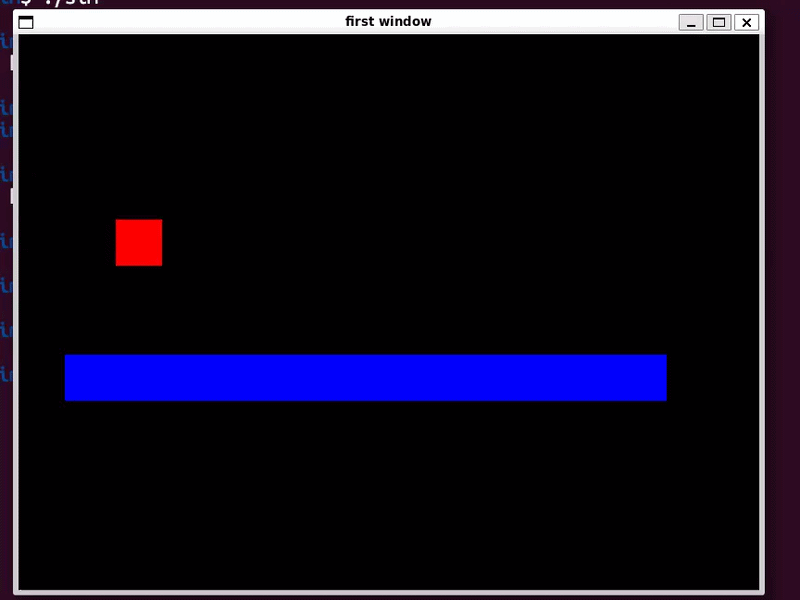

# Collision Simulation with Gravity

## 📖 Overview
This project simulates a block falling under gravity and colliding with the floor.  
After each collision, the block’s velocity decreases according to the **coefficient of restitution (COR)**, which models energy loss during impact.  
The simulation is implemented in **C++**, with graphical rendering for visualization.

---

## 🔬 Physics Background

### 1. Gravity
The block accelerates downward due to gravity:


$F = m \cdot g$


- $m$: mass of the block  
- $g$: gravitational acceleration (9.81 m/s²)

Velocity update during free fall:


$v = v_0 + g \cdot t$

- $v_{0}$ = 0 


### 2. Collision with Floor
When the block hits the floor, its velocity is updated using the **coefficient of restitution (e)**:


$v_{\text{after}} = -e \cdot v_{\text{before}}$


- $e = 1$: perfectly elastic collision (no energy loss)  
- $0 < e < 1$: partially elastic collision (velocity reduced)  
- $e = 0$: perfectly inelastic collision (block stops)

### 3. Energy Loss
Kinetic energy before collision:


$E_{\text{before}} = \frac{1}{2} m v^2$


After collision:


$E_{\text{after}} = \frac{1}{2} m (e \cdot v)^2$


Energy ratio:


$\frac{E_{\text{after}}}{E_{\text{before}}} = e^2$


---

## ⚙️ Technologies
- **C++** — simulation logic  
- **SDL3** — visualization of block motion and collisions  

---

## 🎨 Demo
  

---

## 🚀 How to Run
```bash
 g++ sim.cpp -o sim `pkg-config --cflags --libs sdl3`
./sim
